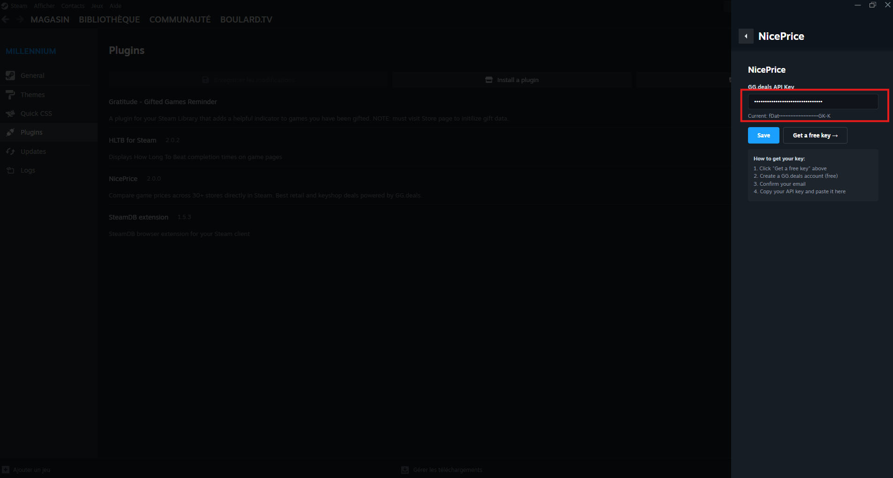
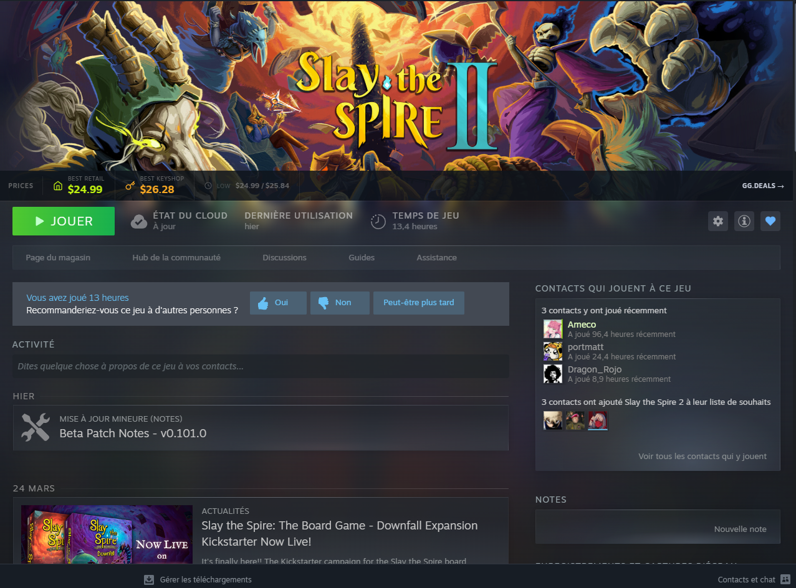
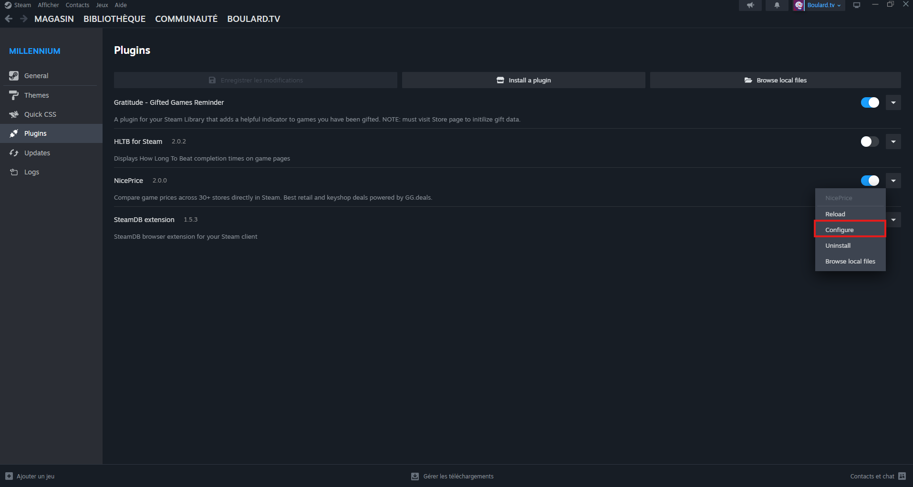

# NicePrice

Compare game prices across 30+ stores directly inside the Steam client. See the best retail and keyshop deals at a glance, powered by [GG.deals](https://gg.deals/).

## Features

- Best retail and keyshop prices on every game page
- Historical lowest prices
- Direct links to GG.deals for full deal listings
- Works in both Steam Library and Store pages
- Auto-adapts to any Steam theme
- Your API key stays local — stored in `settings.json`, never sent anywhere except GG.deals

## Installation

### Via Millennium (recommended)

1. Install [Millennium](https://steambrew.app/) if you haven't already
2. Open Steam, go to the Millennium plugin browser
3. Search for **NicePrice** and click Install
4. Restart Steam

### Manual

1. Install [Millennium](https://steambrew.app/)
2. Clone this repo into your plugins folder:
   ```
   cd "C:\Program Files (x86)\Steam\plugins"
   git clone https://github.com/YOUR_USERNAME/NicePrice.git
   ```
3. Install dependencies and build:
   ```bash
   cd NicePrice
   npm install
   npm run build
   ```
4. Restart Steam

## Setup

NicePrice requires a free [GG.deals API](https://gg.deals/api/) key:

1. Go to [gg.deals/api](https://gg.deals/api/)
2. Create an account and confirm your email
3. Copy your API key
4. In Steam, open the NicePrice settings panel and paste your key



Your API key is masked in the input field and stored locally in `settings.json`. It is only used to call the GG.deals API.

## Screenshots

### Library — Price Bar

Best retail, keyshop and historical lowest prices displayed directly on the game page.



### Millennium Plugins

NicePrice in the Millennium plugin list. Right-click to access settings.



## Project Structure

```
NicePrice/
  plugin.json             Millennium manifest
  package.json            Dependencies and build scripts
  backend/
    main.lua              API calls, settings persistence
  frontend/
    index.tsx             Library widget (SharedJSContext)
  webkit/
    index.tsx             Store page widget (browser context)
```

## Credits

- Price data by [GG.deals](https://gg.deals/)
- Built on [Millennium](https://steambrew.app/)

## License

MIT
